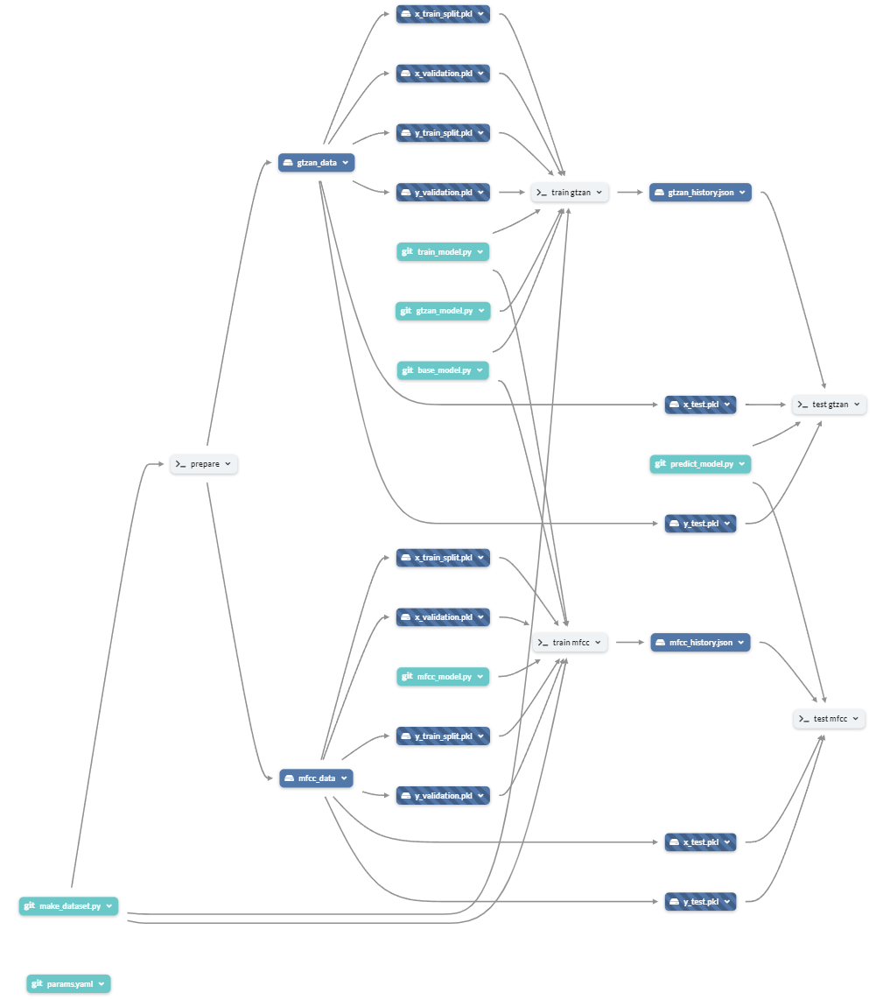
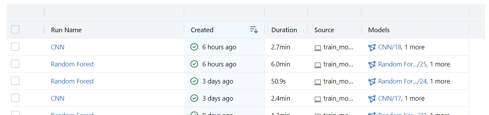
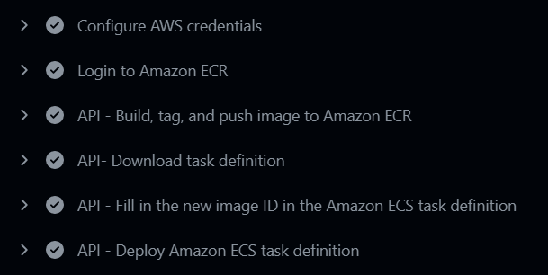
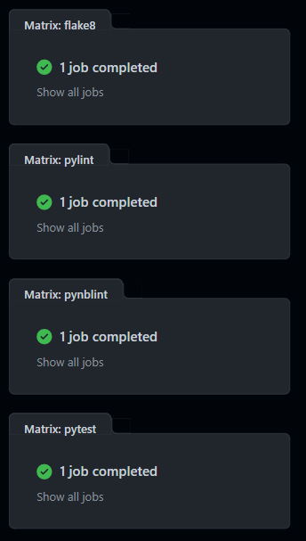
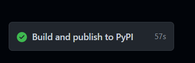

MUSIC GENRE CLASSIFICATION
==============================

## Intro - Project Idea
> Music Classification aims to understand the music semantics over various different features.
In this project we have proposed a novel ensemble model for the Music Genre Classification task which try to 
classify music based on its genre.
The final model is created by combining the predictions from multiple models: Random forest algorithm and Convolutional
Neural Network. It scores on test set an accuracy of 87%.

### Project Structure
This project used the [Cookiecutter🍪 template](https://cookiecutter.readthedocs.io/en/stable/README.html) and is composed
of 3 components:
*  WEB APP Module:
    *  [Frontend](tinyurl.com/y88w7fjj): GUI application  
    *  [Backend](tinyurl.com/yv53fysb): Rest api
*  Observability Module:
    * Grafana dashboard created with:
        * Prometheus
        * Tempo
        * Loki
*  PyPI package for song features extraction:
    * [feat_extractor](https://pypi.org/project/feat-extractor/)
<details>
<summary>Project detailed tree structure 🔍 [CLICK TO EXPAND] <br>
</summary>

```
📦music-genre-classification
 ┣ 📂.dvc
 ┣ 📂.github                                         
 ┃ ┗ 📂workflows                                 : project pipelines
 ┃ ┃ ┣ 📜aws_deploy_api.yml                      : backend app aws deploy 
 ┃ ┃ ┣ 📜aws_deploy_app.yml                      : frontend app aws deploy
 ┃ ┃ ┣ 📜linter.yml                              : code checks and tests
 ┃ ┃ ┗ 📜release_to_pypi.yml                     : pypi package release
 ┃ ┣ 📜.gitignore
 ┣ 📂data                                        : Hosted Dataset 
 ┃ ┣ 📂processed                                 : PROCESSED DATA - DVC hosted
 ┃ ┃                       
 ┃ ┃ ┣ 📂gtzan_data                              : 1° dataset
 ┃ ┃ ┃ ┣ 📜x_test.pkl                            : test dataset features
 ┃ ┃ ┃ ┣ 📜x_train.pkl                           : train dataset features
 ┃ ┃ ┃ ┣ 📜x_train_split.pkl                     : train subset dataset features
 ┃ ┃ ┃ ┣ 📜x_validation.pkl                      : test subset dataset features
 ┃ ┃ ┃ ┣ 📜y_test.pkl                            : test dataset labels
 ┃ ┃ ┃ ┣ 📜y_train.pkl                           : train dataset labels
 ┃ ┃ ┃ ┣ 📜y_train_split.pkl                     : train subset dataset labels
 ┃ ┃ ┃ ┗ 📜y_validation.pkl                      : test subset dataset labels
 ┃ ┃ ┃      
 ┃ ┃ ┗ 📂mfcc_data                               : 2° dataset                       
 ┃ ┃ ┃ ┣ 📜x_test.pkl                            : ...        
 ┃ ┃ ┃ ┣ 📜x_train.pkl                           : ...
 ┃ ┃ ┃ ┣ 📜x_train_split.pkl                     : ...
 ┃ ┃ ┃ ┣ 📜x_validation.pkl                      : ...
 ┃ ┃ ┃ ┣ 📜y_test.pkl                            : ...
 ┃ ┃ ┃ ┣ 📜y_train.pkl                           : ...
 ┃ ┃ ┃ ┣ 📜y_train_split.pkl                     : ...
 ┃ ┃ ┃ ┗ 📜y_validation.pkl                      : ...
 ┃ ┃                            
 ┃ ┗ 📂raw                                       - RAW DATA - Google Drive hosted                 
 ┃ ┃ ┗ 📂dataset                                 : 1000 songs, 10x genre
 ┃ ┃ ┃ ┣ 📂genres_original                       : Original .wav song
 ┃ ┃ ┃ ┃ ┣ 📂blues                               : 100 blues songs
 ┃ ┃ ┃ ┃ ┣ 📂classical                           : 100 classical songs
 ┃ ┃ ┃ ┃ ┣ 📂country                             : 100 contry songs
 ┃ ┃ ┃ ┃ ┣ 📂disco                               : ...
 ┃ ┃ ┃ ┃ ┣ 📂hiphop                              : ...
 ┃ ┃ ┃ ┃ ┣ 📂jazz                                : ...
 ┃ ┃ ┃ ┃ ┣ 📂metal                               : ...
 ┃ ┃ ┃ ┃ ┣ 📂pop                                 : ...
 ┃ ┃ ┃ ┃ ┣ 📂reggae                              : ...
 ┃ ┃ ┃ ┃ ┗ 📂rock                                : 100 rock songs
 ┃ ┃ ┃ ┗ 📜features_3_sec.csv                    : Song features
 ┣ 📂notebooks
 ┃ ┣ 📜audio_augmentation.ipynb                  : Song augmentation notebook
 ┃ ┗ 📜feat_extractor.ipynb                      : Song features extractor 
 ┣ 📂observability                               : Observability module
 ┃ ┣ 📂grafana                                   
 ┃ ┃ ┣ 📂dashboards                              
 ┃ ┃ ┃ ┗ 📜dashboards.json                       : Grafana dashboard implementation 
 ┃ ┃ ┣ 📜dashboards.yml                          : Grafana config
 ┃ ┃ ┣ 📜data_source.yml                         : Grafana data source 
 ┃ ┃ ┗ 📜grafana.ini                             
 ┃ ┣ 📂prometheus
 ┃ ┃ ┣ 📜alert.yml                               : Prometheus alerts 
 ┃ ┃ ┗ 📜prometheus.yml                          : Prometheus config
 ┃ ┗ 📂tempo 
 ┃ ┃ ┗ 📜tempo.yml                               : Tempo config
 ┣ 📂reports
 ┃ ┣ 📂figures                                   
 ┃ ┣ 📂history                                   : Pipeline track files
 ┃ ┃ ┣ 📜gtzan_history.json
 ┃ ┃ ┗ 📜mfcc_history.json
 ┃ ┗ 📂tests                                     : Test track files
 ┃ ┃ ┣ 📜deep_checks.json                        : ─┒
 ┃ ┃ ┣ 📜deep_gtzan_checks.html                  :  ┣──> Deep checks reports file
 ┃ ┃ ┗ 📜deep_mfcc_checks.html                   : ─┛
 ┣ 📂src                 
 ┃ ┣ 📂api                                       : App BE folder
 ┃ ┃ ┣ 📂entities                                : Api models
 ┃ ┃ ┃ ┣ 📜model_allowed_enum.py
 ┃ ┃ ┃ ┣ 📜predict_model_request.py
 ┃ ┃ ┣ 📜api_rest.py                             : Api controller
 ┃ ┃ ┣ 📜music_prediction.py                     : Api services
 ┃ ┃
 ┃ ┣ 📂app                                       : App FE folder
 ┃ ┃ ┣ 📜gradio_app.py                           : App main
 ┃ ┣ 📂data                                      : Data modeling
 ┃ ┃ ┣ 📜data_utils.py                       
 ┃ ┃ ┣ 📜make_dataset.py                         
 ┃ ┣ 📂feat_extractor                            : PyPi package used in APP
 ┃ ┃ ┣ 📜feat_extractor.py
 ┃ ┣ 📂models                                    
 ┃ ┃ ┣ 📂classes                                  
 ┃ ┃ ┃ ┣ 📜base_model.py                         : Common Model
 ┃ ┃ ┃ ┣ 📜gtzan_model.py                       
 ┃ ┃ ┃ ┣ 📜mfcc_model.py
 ┃ ┃ ┣ 📜evaluation.py                           : Model evaluation utils
 ┃ ┃ ┣ 📜model_utils.py                          : Model creation utils
 ┃ ┃ ┣ 📜predict_model.py                        : Pipeline script for testing
 ┃ ┃ ┣ 📜train_model.py                          : Pipeline script for training
 ┃ ┣ 📂visualization
 ┃ ┃ ┣ 📜visualize.py                            : Song feature visualization
 ┃ ┣ 📜pathUtils.py                              : Relative project paths
 ┃ ┣ 📜setup.py
 ┣ 📂tests
 ┃ ┣ 📂api_tests
 ┃ ┃ ┗ 📜test_api.py                             : Unit tests - API
 ┃ ┣ 📂dataset_tests 
 ┃ ┃ ┣ 📜test_dataset_integrity.py               : Integrity tests - DATASET     
 ┃ ┃ ┗ 📜test_dataset_util.py                    : Unit tests - DATASET
 ┃ ┣ 📂feat_extractor_tests
 ┃ ┃ ┗ 📜test_feat_extractor.py                  : Unit tests - PyPI package
 ┃ ┣ 📂models_tests
 ┃ ┃ ┣ 📜test_behavioral_model.py                : Behavioral Tests - MODEL
 ┃ ┃ ┗ 📜test_model.py                           : Unit tests - MODEL
 ┃ ┣ 📂path_utils_tests                          
 ┃ ┃ ┗ 📜test_path_utils.py                      : Unit tests - PATH UTILS
 ┃ ┣ 📂resources                             
 ┃ ┃ ┣ 📂augmented                           
 ┃ ┃ ┃ ┣ 📂noise                                            
 ┃ ┃ ┃ ┗ 📂shift_time
 ┃ ┃ ┗ 📜hip_hop_test.wav
 ┃ ┣ 📂test_utils
 ┃ ┃ ┣ 📜mock_dataset.py
 ┃ ┃ ┣ 📜utils.py
 ┣ 📜docker-compose.yml                          : docker compose for BE/FE/Observability
 ┣ 📜Dockerfile-be                               : BE docker file
 ┣ 📜Dockerfile-fe                               : FE docker file
 ┣ 📜dvc.yaml                                    : DVC pipeline file
 ┣ 📜params.yaml                                 : DVC pipeline params
 ┣ 📜requirements.txt
 ┣ 📜requirements_be.txt
 ┣ 📜requirements_fe.txt
 ┣ 📜setup.py                                    : Src folder installation
 ```

 </details>
 
 ## Inception
 
 ### Model card
 The Music Genre classifier is an ensemble model which combines:
* [Random Forest](docs/model_cards/model_card_RF.md)
* [Convolutional Neural Network](docs/model_cards/model_card_CNN.md)
 
 
 ### Dataset card
The models described above use the following datasets respectively:
* [GTZAN Dataset](docs/dataset_cards/gtzan_dataset_card.md)
* [MFCC Dataset](docs/dataset_cards/mfcc_dataset_card.md)
 
## Reproducibility

### Dagshub
Dagshub is a Github's inspired platform, specifically created for data science projects, that allows to host, version, and manage code, data, models, experiments, Dagshub is free and open-source

### DVC
DVC is a software, based on Git, that allows to version data and track data science experiments.
In this project, the contents of the data folder is stored and tracked using DVC. The remote storage used is the one offered by Dagshub.

### PyPi
The Python Package Index (PyPI) is a repository of software for the Python programming language. <br>
PyPI helps you find and install software developed and shared by the Python community.
In order to split the models module and the GUI app, the share logic, for features extraction, is exported as pypy package.
This choice provides not only a logical separation but also allowed to divide this project into 3 sub-project:
* one for the model module
* one for the app
* one for the pypi package

### Pipelines
DVC allows not only to version data, but also to create fully reproducible pipelines. The pipelines are defined using the CLI or by manually editing the dvc.yaml file.
<br>
A pipelines of 5 steps has been defined:
* **prepare**: dowload dataset if not exitst from a google drive source, load GTZAN dataset and create MFCC dataset.
* **train gtzan**: train model on the train data of the GTZAN dataset 
* **train mfcc**: train model on train data of the MFCC dataset
* **test gtzan**: test model on the test data of the GTZAN dataset
* **test mfcc**: test model on the test data of the MFCC dataset
<br>


The pipeline can be configured using the params.yaml file. This file contains configurations for the type of the model.
By setting the correct params, it is possible to choose which model should be trained or tested.

## MLFlow
MLFLow is a software that allows to track Machine Learning experiments and models. It stores the metrics of the experiments, allowing the developer to compare different models and parameters. Also, allows to store the models and retrieve them when needed.
In this project MLflow tracks every experiment, params and metrics which are available for consultation in a convenient GUI.
<br>


## ENVIROMENT
### local .env
The .env file is not shared for security reason. 
But the env of this project contain the following variables:

* MLFLOW_TRACKING_URI
* MLFLOW_TRACKING_USERNAME
* MLFLOW_TRACKING_PASSWORD
* API_URL

### Github variables and secrets
In the github actions the env variables described above are needed to run the different pipeline. In order to store them 
in a safe place, the following github secrets has been defined:
<br>
* AWS_ACCESS_KEY_ID
* AWS_SECRET_ACCESS_KEY
* MLFLOW_TRACKING_PASSWORD
* MLFLOW_TRACKING_URI
* MLFLOW_TRACKING_USERNAME
* PYPI_API_TOKEN
* PYPI_USERNAME

## Github workflow

### AWS - deploy API/APP 🕸
* Trigger: src/api or src/app folder modified
* Action: aws deploy


### AWS - Linter 🐍
* Trigger: every commit
* Action: code checks


### PyPI - release Feature Extractor 🌪
* Trigger: new tag created
* Action: pypi release
