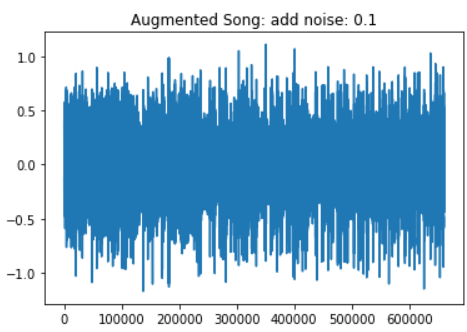
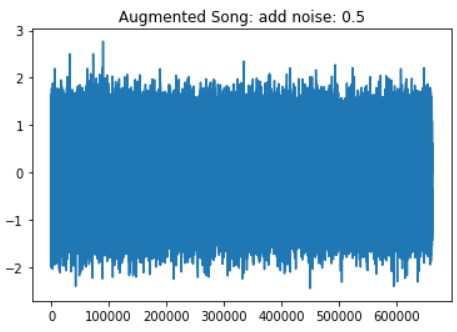
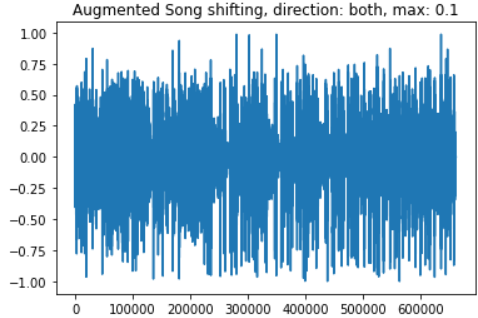
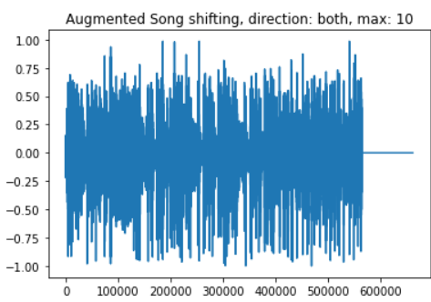
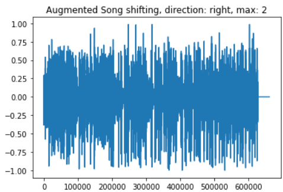
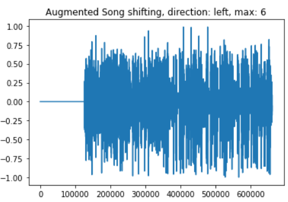

# Behavioural tests

This behavioural tests are concerned to test how model react to some input perturbation. 
Note: these tests have no assert because they are used to observe how a model behaves in the presence of songs disturbed by noises or musical shifs.

## NORMAL MUSIC TRACK TEST

* Genre: POP
* Predicted: POP
* Normal track:
* Status: PASSED

## NOISE TESTS

### NOISE 0.01

* Genre: POP
* Predicted: POP
* Normal track:
* Status: PASSED

### NOISE 0.1

* Genre: POP
* Predicted: POP
* Normal track:
* Status: PASSED

### NOISE 0.2

* Genre: POP
* Predicted: HIPHOP
* Normal track:
* Status: FAILED

### NOISE 0.5

* Genre: POP
* Predicted: COUNTRY
* Normal track:
* Status: FAILED

### NOISE 1 - FULL NOISE

* Genre: POP
* Predicted: RANDOM LABEL
* Normal track:
* Status: FAILED

## SHIFT TESTS

### SHIFT 0.1 BOTH

* Genre: POP
* Predicted: POP
* Normal track:
* Status: PASSED

### SHIFT 0.2 LEFT

* Genre: POP
* Predicted: COUNTRY
* Normal track:
* Status: FAILED

### SHIFT 10 BOTH

* Genre: POP
* Predicted: COUNTRY
* Normal track:
* Status: FAILED

### SHIFT 3 BOTH

* Genre: POP
* Predicted: COUNTRY
* Normal track:
* Status: FAILED

### SHIFT 2 RIGTH

* Genre: POP
* Predicted: COUNTRY
* Normal track:
* Status: FAILED

### SHIFT 6 LEFT

* Genre: POP
* Predicted: COUNTRY
* Normal track:
* Status: FAILED

## OBSERVATION
This model should be train with more augmented data in order to perform better on this tests.
It seems to be sensitive both to noise and even more to data shift.

