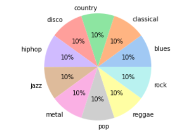

# Dataset Card for GTZAN

### Dataset Description

* **Original dataset**: https://www.kaggle.com/datasets/andradaolteanu/gtzan-dataset-music-genre-classification
* **Homepage**: https://drive.google.com/uc?id=1hCOpQpQbDEhswsuSchSpVDmW6w-VfJ8X&export=download&confirm=t&uuid=1d2e5d2c-ecbb-4bbd-be85-e17bd545e4af"
* **Dataset analysis**: https://paperswithcode.com/dataset/gtzan
* **Point of Contact**: Francesco Ranieri (ranierifra99@hotmail.it, f.ranieri27@studenti.uniba.it)

### Dataset Summary
In 2002, G. Tzanetakis and P. Cook presented their well-known article on genre classification, “Musical genre classification of audio signals”, 
published in IEEE Transactions on Audio and Speech Processing.

GTZAN Genre Dataset represents a total of 1000 audio tracks of 30-second duration.

###  Supported Tasks and Leaderboards
The tasks supported by this dataset are:

* Music Genre Classification

### Languages
Many songs consist of just the melody, others instead present some phrases in Spanish and English

## Dataset Structure
### Data Instances
The gtzan audio dataset contains 1000 tracks of 30 second length. There are 10 genres, each containing 100 tracks which are all 22050Hz Mono 16-bit audio files in .wav format. The genres are:

* blues
* classical
* country
* disco
* hiphop
* jazz
* metal
* pop
* reggae
* rock

### Data Fields
The dataset is represented by a .csv file and it is available in two different format:
* features_30_sec.csv
* features_3_sec.csv
 
Both of dataset form extract 58 features from a single music track and the main difference it the number of total tracks.
The first one (the original one) has 1000 songs and the 58 features are extract for a single song.
The second one (the popular one) is still propesed by the authors and simply divide each song in 10 sub songs of 3 seconds in duration.
This dataset processing increases the number of music track to 10.000 and so the features are extracted for a 3 seconds track instead of a 30 second one.

### Project Note
For this project the 3 seconds dataset proposal was used (features_3_sec.csv) but is also possible to train each model with the 30 seconds variation.

## Additional Information
### Dataset Curators
The curator of the original dataset are G. Tzanetakis and P. Cook.  
The original paper could be found [here](https://ieeexplore.ieee.org/document/1021072).