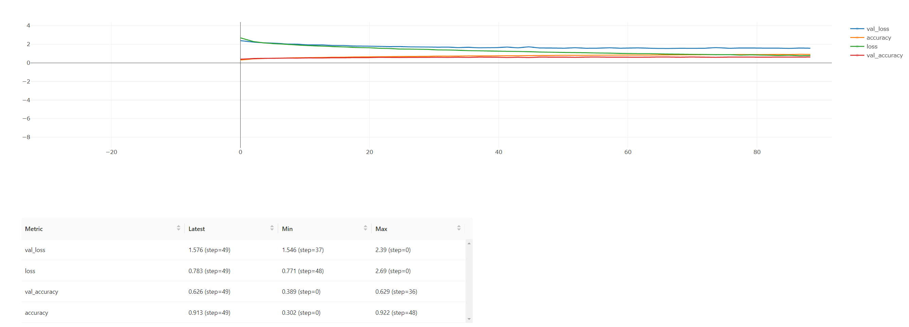

# Model Card for Convolutional Neural Network (CNN)

<!-- Provide a quick summary of what the model is/does. -->

The model is a Convolutional Neural Network (CNN) trained on the [MFCC dataset](../dataset_cards/mfcc_dataset_card.md).
It predicts the music genre.

## Model Details

- **Developed by:** Francesco Ranieri (ranierifra99@hotmail.it, f.ranieri27@studenti.uniba.it)
- **Library:** tensorflow
- **Model type:** Random Forest
- **Model date:** 2023
- **License:**  [MIT License](../../LICENSE)
- **Paper:**  [Music Genre Classifiction Paper](../paper/paper.pdf)


## Use cases

<!-- Address questions around how the model is intended to be used, including the foreseeable users of the model and those affected by the model. -->
This model could be used as music genre classifier.

## Out of Scope cases

This model is not intended to be used for Music Name Recognizer.

# Bias, Risks, and Limitations

<!-- This section is meant to convey both technical and sociotechnical limitations. -->

This dataset used to train this model is composed of 10000 songs divided in 10 different genres:
* blues
* classical
* country
* hip hop
* pop
* reggae
* rock
* metal
* disco
* jazz

The limitation of this model is that it can predict only one of this classes and the music should be 
the cleanest audio possible. Adding augmented data to the dataset could alleviate this model disadvantage.
Also the input of this network must be in (None, 130, 13, 1) dimension.

# Training Details

## Training Data

This model has been trained on the [MFCC Dataset](../dataset_cards/gtzan_dataset_card.md).
The dataset was split randomly in:
* training data (67%)
    * actual training data (67%) &nbsp;&nbsp;&nbsp;&nbsp; : for parameters fine-tuning
    * validation data (33%) &nbsp;&nbsp;&nbsp;&nbsp;&nbsp;&nbsp;&nbsp;&nbsp;&nbsp;&nbsp;&nbsp;&nbsp; : for testing parameters fine-tuning
* test data (33%)


## Training Procedure

<!-- This relates heavily to the Technical Specifications. Content here should link to that section when it is relevant to the training procedure. -->

### Parameters

| Name                  | Value  |
| --------------------- | ------ |
| batch_size            | 32     |
| class_weight          | None   |
| epochs                | 1      |
| initial_epoch         | 0      |
| max_queue_size        | 10     |
| opt_amsgrad           | False  |
| opt_beta_1            | 0.9    |
| opt_beta_2            | 0.999  |
| opt_decay             | 0.0    |
| opt_epsilon           | 1e-07  |
| opt_learning_rate     | 0.0001 |
| opt_name              | Adam   |
| sample_weight         | None   |
| shuffle               | True   |
| steps_per_epoch       | None   |
| use_multiprocessing   | False  |
| validation_batch_size | None   |
| validation_freq       | 1      |
| validation_split      | 0.0    |
| validation_steps      | None   |
| workers               | 1      |

### Model shape

Model: "sequential"
```
_________________________________________________________________
 Layer (type)                Output Shape              Param #   
=================================================================
 batch_normalization (BatchN  (None, 130, 13, 1)       4         
 ormalization)                                                   
                                                                 
 conv2d (Conv2D)             (None, 128, 11, 8)        80        
                                                                 
 max_pooling2d (MaxPooling2D  (None, 64, 6, 8)         0         
 )                                                               
                                                                 
 conv2d_1 (Conv2D)           (None, 62, 4, 32)         2336      
                                                                 
 max_pooling2d_1 (MaxPooling  (None, 31, 2, 32)        0         
 2D)                                                             
                                                                 
 flatten (Flatten)           (None, 1984)              0         
                                                                 
 dense (Dense)               (None, 128)               254080    
                                                                 
 dense_1 (Dense)             (None, 64)                8256      
                                                                 
 dense_2 (Dense)             (None, 10)                650       
                                                                 
=================================================================
Total params: 265,406
Trainable params: 265,404
Non-trainable params: 2
_________________________________________________________________

```

### Speeds, Sizes, Times
The training time is very fast because it fits in the range of 3 to 4 minutes.
# Evaluation

<!-- This section describes the evaluation protocols and provides the results. -->

## Testing Data, Factors & Metrics

### Testing Data

<!-- This should link to a Data Card if possible. -->

Testing data was composed of a random 33% split of the dataset.

### Metrics and Results

| Name                                                                                                                                                                                                                                                                                                                                                            | Value |
| --------------------------------------------------------------------------------------------------------------------------------------------------------------------------------------------------------------------------------------------------------------------------------------------------------------------------------------------------------------- | ----- |
| [accuracy](https://dagshub.com/Francesco-Ranieri/music-genre-classification.mlflow/#/metric/accuracy?runs=[%22a203380f2e514f768a230670b29b69d3%22]&experiments=[%220%22]&plot_metric_keys=[%22accuracy%22]&plot_layout={%22autosize%22:true,%22xaxis%22:{},%22yaxis%22:{}}&x_axis=relative&y_axis_scale=linear&line_smoothness=1&show_point=false&deselected_curves=[]&last_linear_y_axis_range=[])             | 0.959 |
| [loss](https://dagshub.com/Francesco-Ranieri/music-genre-classification.mlflow/#/metric/loss?runs=[%22a203380f2e514f768a230670b29b69d3%22]&experiments=[%220%22]&plot_metric_keys=[%22loss%22]&plot_layout={%22autosize%22:true,%22xaxis%22:{},%22yaxis%22:{}}&x_axis=relative&y_axis_scale=linear&line_smoothness=1&show_point=false&deselected_curves=[]&last_linear_y_axis_range=[])                         | 0.697 |
| [val_accuracy](https://dagshub.com/Francesco-Ranieri/music-genre-classification.mlflow/#/metric/val_accuracy?runs=[%22a203380f2e514f768a230670b29b69d3%22]&experiments=[%220%22]&plot_metric_keys=[%22val_accuracy%22]&plot_layout={%22autosize%22:true,%22xaxis%22:{},%22yaxis%22:{}}&x_axis=relative&y_axis_scale=linear&line_smoothness=1&show_point=false&deselected_curves=[]&last_linear_y_axis_range=[]) | 0.635 |
| [val_loss](https://dagshub.com/Francesco-Ranieri/music-genre-classification.mlflow/#/metric/val_loss?runs=[%22a203380f2e514f768a230670b29b69d3%22]&experiments=[%220%22]&plot_metric_keys=[%22val_loss%22]&plot_layout={%22autosize%22:true,%22xaxis%22:{},%22yaxis%22:{}}&x_axis=relative&y_axis_scale=linear&line_smoothness=1&show_point=false&deselected_curves=[]&last_linear_y_axis_range=[])             | 1.674 |

### Metrics comparison


Dataset Model Card Reference: 
* https://www.kaggle.com/code/var0101/model-cards
* https://github.com/openai/gpt-3/blob/master/model-card.md